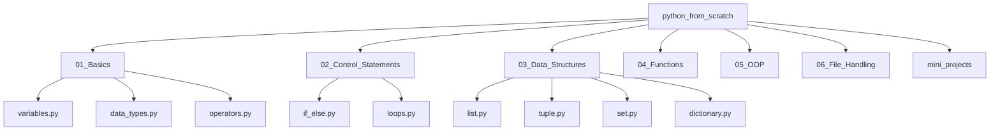

# 🐍 Python From Scratch

> Learn Python from scratch through well-structured programs, logic-building exercises, and practical examples covering fundamentals to advanced concepts.

---

## 📌 About This Repository

This repository is designed to help beginners and intermediate learners build strong foundations in Python programming.  
It contains well-structured examples, concept-wise folders, and practical coding implementations.

Whether you are:

- 👨‍🎓 A student starting programming  
- 💼 Preparing for coding interviews  
- 🧠 Strengthening core concepts  
- 🚀 Exploring Python for projects  

This repository will help you learn step by step.

---

## 📊 Repository Flowchart



---

## 🚀 Topics Covered

- ✅ Python Basics  
- ✅ Variables & Data Types  
- ✅ Operators  
- ✅ Conditional Statements  
- ✅ Loops  
- ✅ Data Structures (List, Tuple, Set, Dictionary)  
- ✅ Functions  
- ✅ Object-Oriented Programming (OOP)  
- ✅ File Handling  
- ✅ Mini Projects  

---

## 💻 How to Run the Programs

### 1️⃣ Clone the repository

```bash
git clone https://github.com/manas-geo/python_from_scratch.git
```

### 2️⃣ Navigate into the folder

```bash
cd python_from_scratch
```

### 3️⃣ Run any Python file

```bash
python filename.py
```

---

## 🎯 Learning Objective

The goal of this repository is to:

- Build strong programming fundamentals  
- Improve logical thinking  
- Develop problem-solving skills  
- Prepare for real-world Python applications  

---

## 🤝 Contribution

Contributions are welcome!  
Feel free to fork the repository and submit pull requests.

---

## 📜 License

This project is licensed under the MIT License.

---

⭐ If you find this repository helpful, consider giving it a star!
